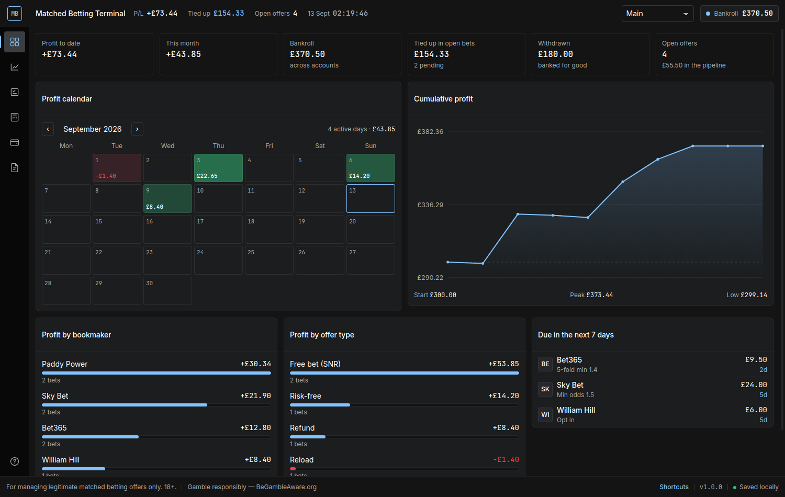

# Matched Betting Terminal

A dark trading-terminal desktop app for matched betting: profit calendar, bet
log with both legs, offer pipeline, five calculators, account and gubbing
tracker, and reporting. Everything is stored locally on your own PC — no cloud,
no account, no internet connection needed once installed.



---

## Just want to use it? Skip everything below

A ready-built installer is already in this repo — no Node.js, no commands:

**[installer/MatchedBettingTerminal-Setup-1.0.0.exe](installer/) → click Download → double-click it.**

Windows will show a blue "Windows protected your PC" box because the app is not
signed with a paid certificate; click **More info** → **Run anyway**. You get a
desktop icon and a Start Menu entry. Full details in
[installer/README.md](installer/README.md).

Everything below is only for **building the app yourself** from source.

---

## Part 1 — Install Node.js (one time only)

Node.js is the toolkit that turns this source code into a Windows program. You
only need it to *build* the app; once the app is installed you never need it
again.

1. Go to **https://nodejs.org**
2. Download the big green button labelled **"LTS"** (long-term support). At the
   time of writing that is **Node.js 22 LTS**. Anything 20 LTS or newer works.
   Pick the **Windows Installer (.msi), 64-bit** version.
3. Run the downloaded file and click **Next** through every screen, then
   **Install**. The default options are correct — you do not need to tick
   anything extra.
4. Restart your PC if it asks.

**Check it worked.** Press the `Windows` key, type `powershell`, press Enter,
and in the blue window type:

```
node --version
```

You should see something like `v22.14.0`. If you see an error instead, Node.js
did not install correctly — reinstall it and restart your PC.

---

## Part 2 — Get to the project folder

Every command below is typed into that same PowerShell window.

**Command 1** — move into the app folder (change the path if you saved the
project somewhere else):

```
cd C:\Users\YourName\Downloads\passswipe-privacy\matched-betting-terminal
```

> Tip: open the `matched-betting-terminal` folder in File Explorer, click the
> address bar, copy the path, and paste it after `cd `.

**Command 2** — download the building blocks the app needs. This takes a few
minutes the first time and prints a lot of text. Warnings are normal; only stop
if it says `ERR!` and finishes early.

```
npm install
```

---

## Part 3 — Try it out first (dev mode)

**Command 3** — launch the terminal in development mode:

```
npm run dev
```

The app window opens in a few seconds. This is the real app — try the
calculator, add an offer, log a bet.

To close it: close the app window, then click on the PowerShell window and press
`Ctrl + C`.

> Dev mode is optional. If you just want the installer, skip to Part 4.

---

## Part 4 — Build the Windows installer

**Command 4** — build the app icon and the installer `.exe`:

```
npm run dist
```

This takes 2–5 minutes the first time because it downloads the Windows app
runtime. You will see a lot of scrolling text. When it finishes you'll be back
at a normal prompt.

---

## Part 5 — Install it

**Where the installer is:** inside the project folder, open the new **`release`**
folder. Inside you will find:

```
MatchedBettingTerminal-Setup-1.0.0.exe
```

1. **Double-click** that file.
2. Windows SmartScreen may show a blue "Windows protected your PC" box. This is
   only because the app is not signed with a paid certificate — it is your own
   app, built on your own machine. Click **More info**, then **Run anyway**.
3. Choose **Just for me** if it asks, then click **Install**.
4. Leave **Run Matched Betting Terminal** ticked and click **Finish**.

**What you get:** the installer automatically creates

- a **desktop shortcut** with the "MB" terminal icon, and
- a **Start Menu entry** under "Matched Betting Terminal".

---

## Part 6 — Using it from now on

**Double-click the "Matched Betting Terminal" icon on your desktop.** That's it.
No PowerShell, no browser, no commands, ever again. You can also pin it to the
taskbar (right-click the icon → Pin to taskbar).

To uninstall: Windows Settings → Apps → Matched Betting Terminal → Uninstall.
Your saved data is deliberately left behind in case you reinstall.

---

## Command summary

| # | Command | What it does |
|---|---------|--------------|
| 1 | `cd <project folder>` | Moves PowerShell into the app folder |
| 2 | `npm install` | Downloads the building blocks (once) |
| 3 | `npm run dev` | Opens the app in development mode (optional) |
| 4 | `npm run dist` | Builds `release\MatchedBettingTerminal-Setup-1.0.0.exe` |

---

## What the terminal does

Six tabs down the left rail. Press `F1`–`F6` to switch, or `?` for the full key map.

**Dashboard (F1)** — profit calendar with colour-coded days, cumulative profit
chart, and headline figures: profit to date, this month, bankroll across all
accounts, money tied up in open bets, total withdrawn, and open offers. Below
that, profit split by bookmaker and by offer type, plus anything due in the next
seven days.

**Bet log (F2)** — every bet as a back leg and a lay leg. Bookmaker, stake and
odds on one side; exchange, lay stake, lay odds and commission on the other.
The form shows the liability and the locked figure live as you type. Each row
carries an offer type (qualifying, free bet SNR/SR, risk-free, reload, refund,
casino) and a status (pending, back won, lay won, cashed out, void). Pending
rows show their expected profit; settled rows show what actually landed. Search
and filter by bookmaker, type or status.

**Offers (F3)** — the to-do pipeline: bookmaker, requirement, deadline, expected
profit, status and notes. Set a repeat (weekly, fortnightly, monthly) on reload
offers and the next due date rolls forward automatically. Overdue turns red,
due-within-a-week turns blue.

**Calculators (F4)** — four tools, all offline:

- *Lay stake* — qualifying, free bet SNR and free bet SR, with equal-profit,
  underlay or overlay laying and a per-exchange commission preset.
- *Dutching* — split a stake across any number of outcomes for the same return
  whichever wins, with the book margin.
- *Each-way* — separate win and place lay stakes from the place terms, with the
  outcome if the horse wins, places only, or is unplaced.
- *Casino wagering* — turnover, house edge and expected value for a bonus, so
  you can see when an offer is not worth doing.

Any lay calculation can be pushed straight into the bet log with **Send to bet
log**.

**Accounts (F5)** — balance per bookmaker and exchange, total bankroll, and how
much is currently stuck in open bets at each one. Each account has a status —
active, limited, gubbed or closed — so you can see at a glance where you can
still bet. Withdrawals are logged separately as money banked for good.

**Reports (F6)** — filter by date range, bookmaker and offer type, then read off
profit per bet, per offer and per hour (from the minutes you log against each
bet), total staked and return on stakes. Export the filtered bets to CSV, import
bets from CSV, and take a full JSON backup.

### Odds are entered by hand

This terminal tracks what you type; it does not pull live odds. Automatic
odds-matching needs a paid data feed and a permanent internet connection, which
would undo the offline, no-account design. The bet model stores back and lay
odds in a shape a feed could fill in later without changing the interface.

### Multiple profiles

The switcher in the top-right keeps completely separate sets of accounts,
offers, bets and withdrawals in one file — useful if you run more than one
person's accounts. A JSON backup contains every profile.

### Keyboard shortcuts

| Key | Action |
|-----|--------|
| `F1` … `F6` | Dashboard, bets, offers, calculators, accounts, reports |
| `Ctrl + E` / `Ctrl + I` | Export / import a JSON backup |
| `Esc` | Cancel the current form |
| `?` | Show the key map |

---

## Where your data lives

```
C:\Users\<you>\AppData\Roaming\Matched Betting Terminal\terminal-data.json
```

One plain JSON file, saved automatically as you type. Use **Export JSON** to
make a backup copy somewhere safe, and **Import JSON** to restore it (importing
replaces everything currently in the terminal and asks you to confirm first).

---

## If something goes wrong

**`npm` is not recognised** — Node.js is not installed, or you did not restart
PowerShell after installing it. Close PowerShell, open it again, and retry.

**`npm install` fails** — check you are connected to the internet, and that you
ran `cd` into the `matched-betting-terminal` folder (the one containing
`package.json`), not the folder above it.

**`npm run dist` fails** — run `npm install` again first. If it still fails,
delete the `node_modules` folder and the `release` folder, then run
`npm install` followed by `npm run dist`.

**The app window is blank** — close it and run `npm run dist` again; the build
step may have been interrupted.

---

For managing legitimate matched betting offers only. 18+. Gamble responsibly —
[BeGambleAware.org](https://www.begambleaware.org).
